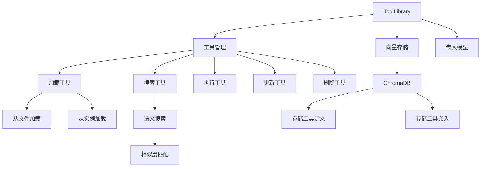
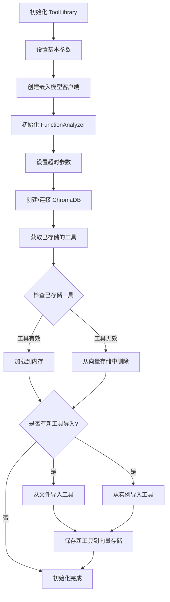
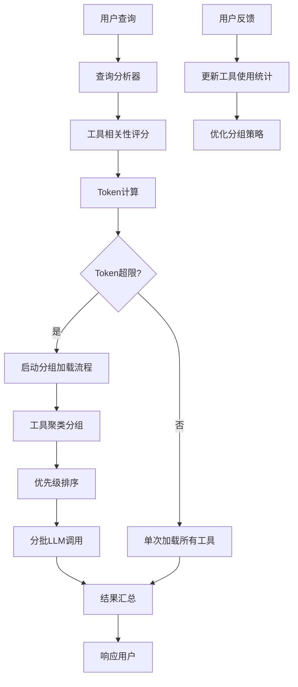
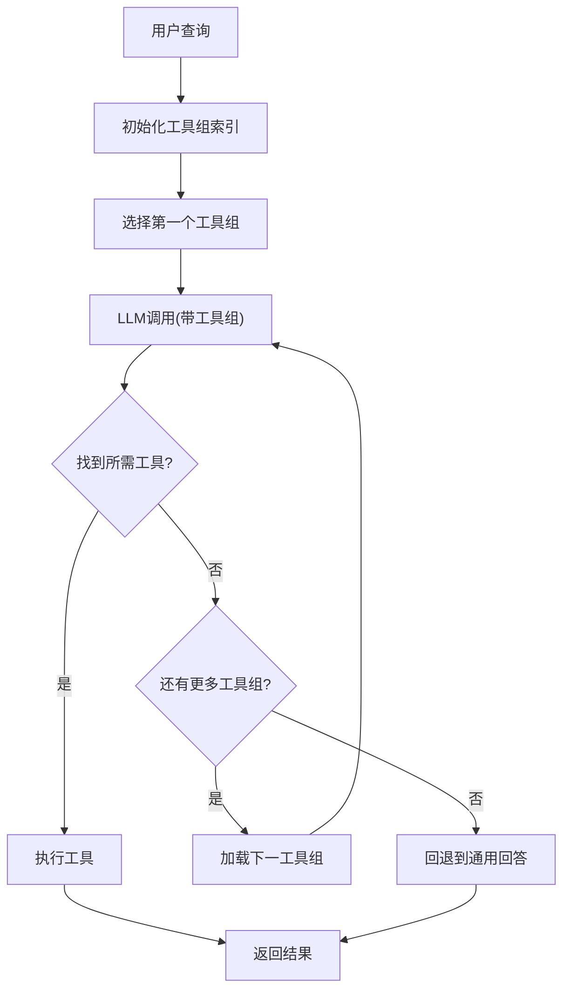
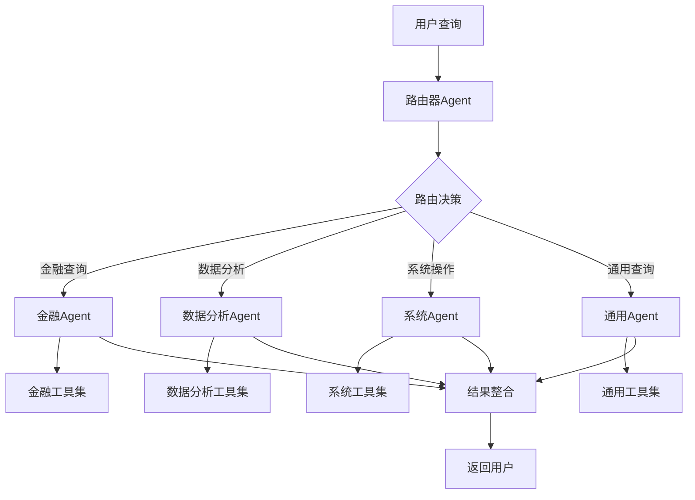
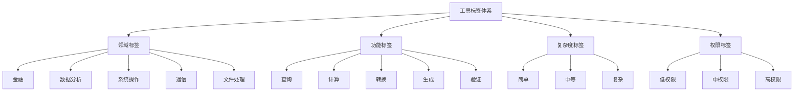
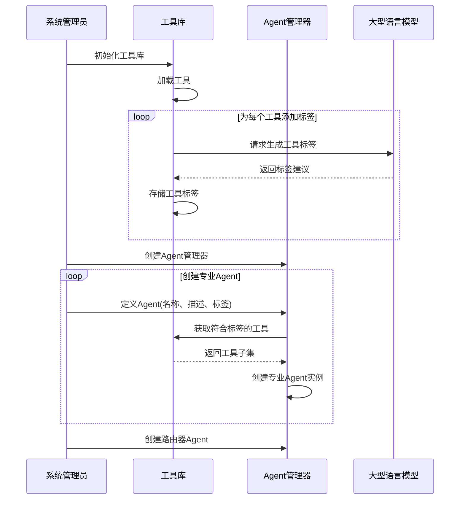
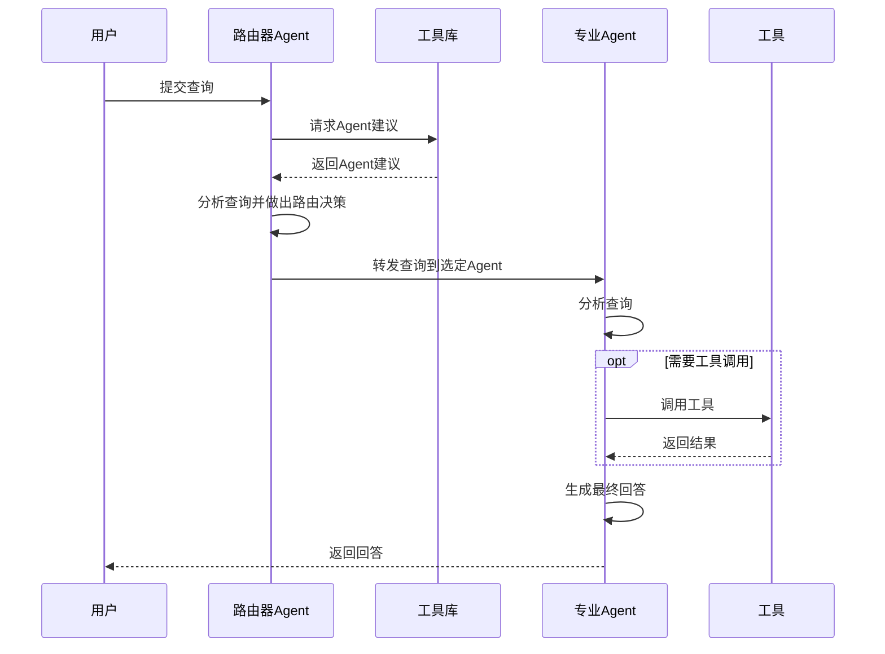

## 方案原理

### rag方案

rag 示例：

- https://github.com/run-llama/llama_index/blob/df48f1d83b032aae3ec232013a11401cd26ea184/docs/docs/examples/agent/openai_agent_retrieval.ipynb#L223
- https://github.com/HRI-EU/tulip_agent/blob/main/examples/tool_library_search.py
- https://hri-eu.github.io/tulip_agent/

#### 工具搜索的原理图



#### 工具嵌入



#### 优化方向

- 增加问题转译，将问题转译为更利于工具搜索的格式
- 问题转译生成 top k 个问题，每个问题对应一个工具集，召回后去重
- 生成 Q & A 对，优化特定问题

### ~~分组加载方案~~

#### 原理概述

分组加载方案是解决大规模工具集管理的关键策略之一。当工具数量增长到一定规模时，将所有工具描述同时传入LLM会迅速耗尽上下文长度限制。分组加载方案通过智能监测和动态分组，确保在token限制内最大化工具使用效率。

#### 核心组件

1. **Token监测器**：
   
   - 实时计算每个工具描述的token数量
   - 预估不同工具组合的总token消耗
   - 监控LLM上下文窗口剩余容量

2. **工具分组引擎**：
   
   - 基于语义相似性聚类相关工具
   - 根据使用频率和历史相关性进行优先级排序
   - 维护工具之间的依赖关系图

3. **LLM调用协调器**：
   
   - 管理多轮工具加载和LLM调用
   - 在工具组之间传递上下文和状态
   - 汇总多次调用的结果

#### 工作流程



#### 分组策略

分组加载采用多种策略来优化工具分组：

1. **基于相似度聚类**：使用工具描述的语义嵌入进行聚类
2. **基于频率分组**：常用工具优先加载
3. **基于任务分组**：相同任务类型的工具组合在一起
4. **动态分组**：根据当前查询实时调整分组

#### 循环加载机制



#### 实现示例

```python
def group_tools_by_token_limit(tools, max_tokens=4000):
    # 计算每个工具描述的token数
    tool_tokens = [(tool, count_tokens(f"{tool.name}: {tool.description}")) 
                  for tool in tools]

    groups = []
    current_group = []
    current_tokens = 0

    for tool, tokens in sorted(tool_tokens, key=lambda x: x[1]):
        if current_tokens + tokens > max_tokens:
            # 当前组达到token上限，创建新组
            groups.append(current_group)
            current_group = [tool]
            current_tokens = tokens
        else:
            current_group.append(tool)
            current_tokens += tokens

    if current_group:
        groups.append(current_group)

    return groups

def cyclic_tool_execution(user_query, tool_groups):
    context = {"query": user_query, "results": []}

    for group_idx, tool_group in enumerate(tool_groups):
        llm_response = call_llm_with_tools(
            context["query"], 
            tool_group, 
            f"This is group {group_idx+1} of {len(tool_groups)}. "
            f"Use these tools if they seem relevant to the query."
        )

        if llm_response.has_tool_calls():
            tool_results = execute_tool_calls(llm_response.tool_calls)
            context["results"].extend(tool_results)

            # 更新查询上下文
            follow_up = call_llm(
                f"Based on these results so far: {tool_results}, "
                f"should we continue searching with more tool groups? "
                f"If yes, refine the search query."
            )

            if "continue" not in follow_up.lower():
                break

            context["query"] = extract_refined_query(follow_up)

    # 合并所有结果生成最终回答
    final_answer = call_llm(
        f"Based on all results: {context['results']}, "
        f"provide a comprehensive answer to the original query: {user_query}"
    )

    return final_answer
```

### 多Agent路由系统设计报告

#### 1. 执行摘要

本报告提出了一个基于工具标签的多Agent路由系统设计方案。该系统通过为每个工具分配适用的Agent标签，实现工具到专业Agent的映射，并通过智能路由机制将用户查询分配给最合适的Agent处理。这种设计能够提高系统的响应效率、专业性和可扩展性，特别适合管理大规模工具库的场景。

#### 2. 系统架构



##### 2.1 核心组件

1. **增强版工具库**
   
   - 扩展现有ToolLibrary，添加Agent标签支持
   - 提供工具-Agent映射管理功能
   - 实现基于查询的Agent推荐机制

2. **Agent管理器**
   
   - 负责创建和管理专业Agent
   - 维护Agent与工具集的关联
   - 协调查询处理流程

3. **专业Agent**
   
   - 每个Agent专注于特定领域
   - 拥有针对该领域优化的工具集
   - 使用定制的系统提示词增强专业能力

4. **路由器Agent**
   
   - 分析用户查询意图
   - 结合工具相关性评估选择合适的Agent
   - 支持查询分解和多Agent协作

#### 3. 工具标签系统

##### 3.1 多维度标签体系



##### 3.2 标签生成策略

使用LLM自动为工具生成标签，基于以下信息：

- 工具名称和描述
- 参数和返回值
- 功能特性和使用场景

**标签生成提示词框架**：

```
请为以下工具分配适当的标签，以便在多Agent系统中使用：

工具名称: [工具名]
描述: [工具描述]
参数: [参数列表]
返回值: [返回值描述]

请从以下类别中为该工具分配标签：
1. 领域标签（选择所有适用的）：[领域选项列表]
2. 功能标签（选择所有适用的）：[功能选项列表]
3. 复杂度标签（选择一个）：[复杂度选项列表]
4. 权限标签（选择一个）：[权限选项列表]

请以JSON格式返回标签，并指明该工具最适合分配给哪些类型的Agent。
```

#### 4. 系统流程

##### 4.1 初始化流程



##### 4.2 查询处理流程



#### 5. 专业Agent配置

##### 5.1 Agent类型与职责

| Agent类型   | 主要职责            | 工具类别           | 优化提示词重点          |
| --------- | --------------- | -------------- | ---------------- |
| 金融Agent   | 处理金融、投资、股票相关查询  | 股价查询、市场分析、投资计算 | 金融术语理解、数据解读、风险评估 |
| 数据分析Agent | 处理数据处理、统计分析相关查询 | 数据处理、统计计算、可视化  | 数据理解、分析方法、结果解释   |
| 系统Agent   | 处理系统操作、文件管理相关查询 | 文件操作、系统命令、进程管理 | 系统知识、安全考虑、效率优化   |
| 通用Agent   | 处理一般性查询和跨领域问题   | 所有工具的子集        | 综合判断、任务分解、知识整合   |

##### 5.2 Agent系统提示词模板

```
你是[Agent名称]，一个专门处理[Agent描述]的AI助手。

你有权访问以下工具来帮助完成任务：
[工具列表及描述]

当用户提出问题时，请按照以下步骤操作：
1. 分析用户的问题和需求
2. 确定需要使用哪些工具来解决问题
3. 调用适当的工具获取必要的信息
4. 基于工具返回的结果，提供清晰、准确的回答

[特定领域的专业指导]

如果工具执行出错，请尝试理解错误原因并提供替代解决方案。
始终以专业、有帮助的方式回应用户。
```

##### 5.3 路由器提示词模板

```
你是一个智能路由器，负责将用户查询分配给最合适的专业Agent。

可用的Agent有：
[Agent列表及描述]

你的任务是：
1. 分析用户查询的内容和意图
2. 确定哪个Agent最适合处理该查询
3. 将查询转发给选定的Agent

如果查询需要多个Agent协作处理，你可以将查询分解为子任务，并分配给相应的Agent。
如果没有Agent明确适合处理查询，将其分配给通用Agent。

请始终以JSON格式返回你的路由决策：
{"selected_agent": "agent_name", "reason": "选择该Agent的原因"}
```

#### 6. 实施建议

##### 6.1 分阶段实施计划

1. **第一阶段：基础设施建设**
   
   - 扩展工具库，添加标签支持
   - 实现基本的Agent管理功能
   - 开发简单的路由机制

2. **第二阶段：专业Agent开发**
   
   - 定义核心Agent类型
   - 为每种Agent优化系统提示词
   - 实现工具-Agent映射

3. **第三阶段：路由优化**
   
   - 开发基于嵌入的相似度计算
   - 实现智能路由决策
   - 添加路由反馈机制

4. **第四阶段：系统集成与优化**
   
   - 实现完整的查询处理流程
   - 添加性能监控和日志
   - 优化系统响应时间

##### 6.2 性能优化建议

- 使用缓存减少重复嵌入计算
- 实现并行处理多Agent查询
- 预计算常见查询类型的路由决策
- 定期更新工具标签以适应变化

##### 6.3 扩展性考虑

- 设计模块化接口便于添加新Agent
- 支持动态加载和卸载工具
- 实现Agent之间的协作通信协议
- 提供自定义Agent和工具标签的接口

#### 7. 评估与监控

##### 7.1 关键性能指标

- **路由准确率**：路由决策的正确性
- **响应时间**：从查询到回答的总时间
- **工具使用效率**：专业Agent使用工具的效率
- **用户满意度**：用户对回答质量的评价

##### 7.2 监控机制

- 记录所有路由决策和执行结果
- 跟踪每个Agent的性能指标
- 分析工具使用模式和效果
- 收集用户反馈并整合到系统改进中

#### 8. 结论

本设计方案通过工具标签和专业Agent的结合，为大规模工具库提供了一种高效的管理和使用方式。系统的核心优势在于：

1. **专业化处理**：每个Agent专注于特定领域，提高回答质量
2. **高效路由**：智能路由机制确保查询被正确分配
3. **可扩展性**：模块化设计便于添加新工具和Agent
4. **资源优化**：每个Agent只加载必要的工具，减少资源消耗

未来可以进一步探索的方向包括：

- 实现Agent之间的协作机制
- 添加学习功能，根据历史数据优化路由
- 开发更复杂的查询分解和结果整合机制
- 实现跨语言和多模态查询处理能力

通过这种设计，系统能够更好地处理复杂查询，提供专业、准确的回答，同时保持良好的性能和可扩展性。

### 主要开源RAG框架工具集成能力比较

| 框架名称       | 主要关注点      | 工具集成能力                                       | 智能体构建支持                       | 向量数据库支持 | 许可证        | GitHub Stars (近似) |
| ---------- | ---------- | -------------------------------------------- | ----------------------------- | ------- | ---------- | ----------------- |
| LangChain  | 通用LLM应用构建  | 是 (丰富的预构建工具，自定义工具，工具调用)                      | 是 (强大的智能体构建框架)                | 广泛支持    | MIT        | ~105k             |
| Dify       | 低代码LLM应用开发 | 是 (通过YAML配置，AgentQL集成，自定义工具)                 | 是 (支持代理编排)                    | 支持多种    | Apache-2.0 | ~90.5k            |
| LlamaIndex | 私有数据LLM连接  | 是 (FunctionTool, QueryEngineTool, ToolSpecs) | 是 (FunctionAgent, ReActAgent) | 广泛支持    | MIT        | ~40.8k            |
| Haystack   | 模块化LLM应用构建 | 是 (Tool类，ComponentTool，@tool装饰器)             | 是 (Agent组件)                   | 支持多种    | Apache-2.0 | ~20.2k            |
| llmware    | 企业级RAG管道   | 是 (支持函数调用)                                   | 是 (支持构建代理)                    | 支持多种    | Apache-2.0 | ~12.7k            |

### 多智能体系统框架及其与工具集成RAG的相关性

| 框架名称                        | 主要支持的架构                 | 工具集成特性                                   | RAG关键优势               | 编程语言   | 许可证          | GitHub Stars (近似) |
| --------------------------- | ----------------------- | ---------------------------------------- | --------------------- | ------ | ------------ | ----------------- |
| LangGraph                   | 网络型，监管者型，分层型，自定义工作流，群集型 | 是 (通过工具调用实现智能体间交互)                       | 灵活的智能体协作和信息传递         | Python | Apache-2.0   | ~105k             |
| AutoGen                     | 多种，强调代码生成和执行            | 是 (智能体可以调用其他智能体作为工具)                     | 强大的代码生成和执行能力，高度可定制    | Python | MIT          | ~90.5k            |
| CrewAI                      | 团队型，基于角色和任务             | 是 (智能体可以使用工具执行任务)                        | 更高层次的抽象，易于构建协作团队      | Python | MIT          | ~40.8k            |
| ADK (Agent Development Kit) | 灵活，针对Gemini和Vertex AI优化 | 是 (支持预构建工具，MCP工具，LangChain/LlamaIndex集成) | 针对谷歌云平台优化，支持多智能体转移和规划 | Python | Apache-2.0   | ~20.2k            |
| Tulip Agent                 | 灵活，支持CRUD操作工具库          | 是 (通过向量存储进行语义工具搜索和执行)                    | 降低推理成本，支持大型工具库        | Python | BSD-3-Clause | ~12.7k            |

## 方案架构

## 验证和评估

以简单基准问题 + 标准问题作为验证：

- 基准问题：
  
  - 查询苹果的最新股价和股息数据
  - 分别查询苹果的 1min、5min、15min、1h、4h 股票数据
  - 苹果目前的资产负债表和现金流量表怎么样？
  - 总结一下最近 10 条股票新闻
  - 从新闻角度分析特朗普币还值得买入吗？

- 标准问题：
  
  - Please extract net profit, total assets and shareholders' equity data from Netflix's financial report, calculate its ROA and ROE, and analyze the impact of its video content capitalization policy on these indicators.
  - Please construct a rolling 12-month EBITDA chart based on the quarterly financial data in Meta's latest annual report and mark the YoY growth rate inflection point.
  - Please analyze the changes in Apple Inc.'s (AAPL) capital structure over the past three years and calculate the changing trend of its weighted average cost of capital (WACC).
  - We extract R&D spending data from Tesla's (TSLA) 10-K reports and analyze its correlation with revenue growth.
  - Analyze the impact of Microsoft's (MSFT) merger and acquisition activities in the past five years on its financial statements, especially the changes in goodwill and intangible assets.

- 复杂问题
  
  - 找出今天 10 支大资金流动的股票/期货。
