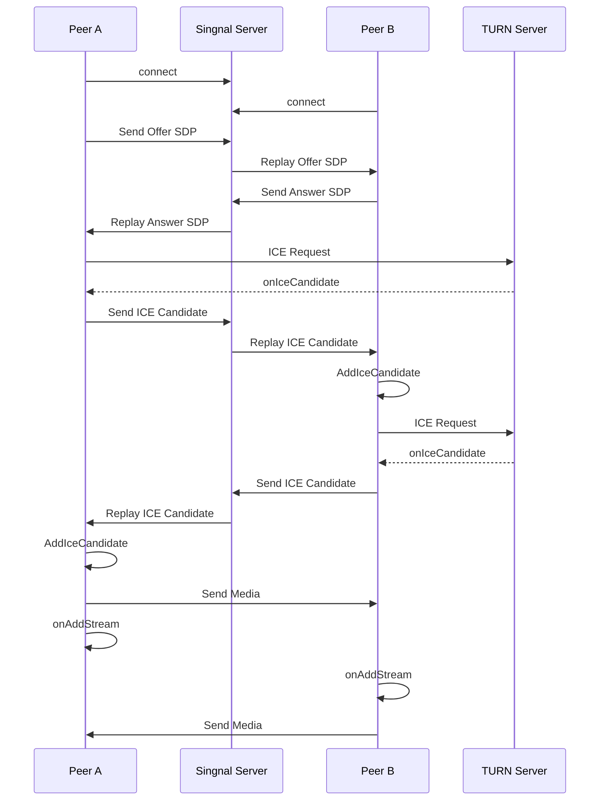

## WebRTC介绍

WebRTC 由用于 Web 实时通信的 JavaScript API 和一组通信协议构成，支持网络上的任何已连接设备成为 Web 上潜在的通信端点。WebRTC 已成为线上通信及协作服务的基石。

2021 年 1 月 26 日，万维网联盟（W3C）和互联网工程任务组（IETF）宣布，Web 实时支持多种服务的通信（WebRTC）现在已成为官方标准，可将音频和视频通信带到 Web 上的任何位置。

W3C也正在研究将WebRTC运用到物联网设备、会议视频加密、机器学习实时处理音视频等方面，所以学习和掌握WebRTC是很有必要，关注前沿技术有助于我们提升自己，也能将更优秀的方案运用到我们的项目当中。

[WebRTC 标准文档](https://www.w3.org/TR/webrtc/)

[WebRTC中文网](https://webrtc.org.cn/)

## WebRTC架构


如上图WebRTC的框架包含视频解密编码等，从开发者的角度，初步学习只需要关注紫色的实线框部分，即通过调用Web API实现通信功能。目前FireFox、Chrome等主流浏览器都集成了WebRTC的API，绿色和蓝色实线框部分都属于浏览器厂商需要关注的内容，而蓝色虚线框部分则是服务器厂商需要关注的部分。

关于WebRTC架构的Session管理层、C++ API层、音视频编码层等具体技术，这里就不详细介绍了。

## WebRTC通信层原理介绍

### 实时传输安全协议SRTP

> 所谓SRTP，即[安全实时传输协议](https://baike.baidu.com/item/安全实时传输协议/10046352?fromModule=lemma_inlink)(Secure Real-time Transport Protocol)，其是在实时传输协议(Real-time Transport Protocol)基础上所定义的一个协议，旨在为[单播](https://baike.baidu.com/item/单播/8946201?fromModule=lemma_inlink)和[多播](https://baike.baidu.com/item/多播/6867723?fromModule=lemma_inlink)应用程序中的实时传输协议的数据提供加密、[消息认证](https://baike.baidu.com/item/消息认证/5388882?fromModule=lemma_inlink)、完整性保证和重放保护。

### 媒体协商SDP

媒体协商是通过对比音视频通信双方所支持的协议，在建立通信之前选择双方或者多方都支持的通信协议。

> 举例：A端支持VP8编码协议和H.264协议(mp4)，B端支持VP9协议和H.264协议，那么两者需要建立通信，只能选用H.264进行视频编码解码。

### 网络协商Candidate

建立端到端通信的双方，需要能够进行IP通信协议的支持，构建持久化连接。当双方其中一方不满足条件，则无法建立连接。常见两种通信方案`STUN`和`TURN`。STUN和TURN服务器可由开源项目cotum构建。

### STUN

当通信双方都具备`公网IP`和`通信端口`时，能够建立`P2P`通信网络，媒体流传输按照P2P方式传输，通信质量只与通信双方的带宽有关。

很多场景不具备构建P2P网络的条件，**当通信一端处于局域网内，不具备公网IP，或者同IP下端口资源分配完毕，无法提供通信端口时，STUN无法构建P2P网络通信**。NAT无法成功分配IP的情况不少见。

### TURN

TURN是STUN/RFC5389的一个扩展，主要提供了`Replay`功能。如果终端在NAT之后，无法进行对等的通信`直接通信`，这是就可以通过`公网服务器作为中继`，对数据进行一个转发。该转发协议被称为TURN协议。

> 可参考VPN架构、MQTT架构理解。

### ICE

ICE是一个框架，该框架整合了STUN和TURN协议。开源项目cotum同样集成了STUN和TURN协议。

### 信令服务器(Singnal Server)<--媒体协商+网络协商

上面讲解了构建实时音视频通信通道的协商内容，这个协商过程就需要通过信令服务器进行数据交互，转发对方的媒体信息和网络信息。

> 举个例子：A端和B端开始视频通话之前，需要在**客户端APP/网站WEB**向对方提交通话请求并发送媒体协商和网络协商的数据，由服务器转发协商数据到对方终端，双方才互有对方的信息，构建音视频通信通道。**这个APP/WEB就是信令服务器。**

因此信令服务器是不局限于开发语言、设备类型、应用类型的。



## Web API

### 基础API

1. `RTCPeerConnection`接口代表一个由本地计算机到远端的 WebRTC 连接。该接口提供了创建，保持，监控，关闭连接的方法的实现。
2. `RTCPeerConnection.createOffer()`创建SDP offer信息的函数。
3. `RTCPeerConnection.setLocalDescription()` 设置本地 SDP 描述信息。
4. `RTCPeerConnection.setRemoteDescription()` 设置远程 SDP 描述信息，即对方的SDP信息。
5. `RTCPeerConnection.createAnswer()` 创建SDP answer信息的函数。
6. `RTCIceCandidate()` 构建ICE的网络信息对象。
7. `RTCPeerConnection.addIceCandidate()` 添加对方的ICECandidate信息。

> Web MDN强烈建议使用[Adapter.js](https://github.com/webrtcHacks/adapter)补充库。以确保网站或 Web 应用程序的兼容性。

### 打开麦克风和摄像头

目前主流的浏览器都支持了`getUserMedia`获取媒体流，具体API和属性查询MDN，不进行赘述。

```javascript
navigator.mediaDevices.getUserMedia({
    video: true,
    audio: true
  }).then(stream => {
    // do something.
    // VideoHtmlElement = stream;
  })
```

### 创建RTC连接

```js
const _pc = new RTCPeerConnection({
    iceServers: [
      {
        urls: ['stun:stun.stunprotocol.org:3478']
      }
    ]
  })
```

#### 添加onicecandidate回调函数

当`RTCPeerConnection`生成offer SDP或者生成Answer SDP的时候，会自动向`iceServers`设置的stun/turn服务器获取nat信息，即ice格式的网络信息。

需要将获取到的candidate信息和通信对方进行交换，完成`P2P`连接。

```js
const _pc = new RTCPeerConnection({
    iceServers: [
      {
        urls: ['stun:stun.stunprotocol.org:3478']
      }
    ]
  })
_pc.onicecandidate = e => {
    if (e.candidate) {
      // 通过信令服务器交互网络信息
      console.log('candidate', JSON.stringify(e.candidate));
    }
  }

```

#### 添加ontrack回调函数

当`RTCPeerConnection`完成握手之后，`ontrack`回调函数获取对方传输过来的媒体流。在这里处理媒体流。

```js
const _pc = new RTCPeerConnection({
    iceServers: [
      {
        urls: ['stun:stun.stunprotocol.org:3478']
      }
    ]
  })
_pc.onicecandidate = e => {
    if (e.candidate) {
      console.log('candidate', JSON.stringify(e.candidate));
    }
  }

_pc.ontrack = e => {
    // do something.
    // VideoHtmlElement = e.streams[0];
  }
```

### 将本地视频流添加到RTC

`localStream`来自`getUserMedia`回调函数。

```js
localStream.getTracks().forEach((track, index) => {
    if (localStream) {
      _pc.addTrack(track, localStream)
      console.log('将本地视频流添加到RTC', track);
    }
  });
```

### 创建SDP offer

```js
_pc.createOffer({
    offerToReceiveAudio: true,
    offerToReceiveVideo: true
  })
    .then((sdp) => {
      console.log('Offer', JSON.stringify(sdp));
      pc.setLocalDescription(sdp);  // 设置成本地描述信息
    }).catch((err) => {
      console.log(err);
    });
```

### 创建SDP answer

```js
pc.createOffer({
    offerToReceiveAudio: true,
    offerToReceiveVideo: true
  })
    .then((sdp) => {
      console.log('Offer', JSON.stringify(sdp));
      pc.setLocalDescription(sdp); // 设置成本地描述信息
    }).catch((err) => {
      console.log(err);

    });
```

> 注意：这里是模拟双方通信的api操作，详情见DEMO。

### 设置远程SDP信息

```js
const remoteSdp = JSON.parse(remoteDesc.value!.value);
_pc.setRemoteDescription(new RTCSessionDescription(remoteSdp));
console.log('成功设置远程描述信息', remoteSdp);
```

> 手动获取输入的话，会发现有多个`IceCandidate`，一般优先输入 udp的局域网地址进行本地测试即可。或者全部添加。

## 内容总结

只要完成上面部分的内容，就足够搭建出`1v1`的视频通信程序，可见WebRTC的使用还是非常方便的。并且WebRTC也是**低延迟**的第一梯队。

通过上面的内容学习，可见WebRTC最大的优点，是可以进行端对端通信，这是什么概念呢，对网络不熟悉的朋友可能无法理解。我们平时看直播、听广播、刷抖音都是非端对端通信，而是在中间通过媒体服务器进行推流才能获取内容的，假如服务器瘫痪了，正在接收的音视频也会因此中断。端对端，即P2P则无需中间服务器，直接通信传输，音视频质量**只与自身网络质量**有关。

当前WebRTC架构中我们了解到了，WebRTC并非不需要服务器，媒体协商和网络协商都需要信令服务器完成，`STUN/TURN`服务器则是获取自身的外网通信地址，或者无法`P2P`时进行转发。

在本文中主要讲解了基于`STUN`的`1v1 WebRTC`通信的原理和实现。而实际应用中，大多数会出现多人通信的场景，比如会议室、游戏语音、你画我猜等。在多人通信中，主要有`Mesh、MCU、SFU`三种架构，并且各有优缺点，由于WebRTC本身主要是端对端通信的协议，多人通信架构相对传统架构来说，没有长处。

传统`RTMP、RTSP、HLS`等推流协议架构成熟，能够轻松应用`CDN`进行媒体分发，对服务器压力小，支持并发高，能轻松达到千万级同时访问，编码解码压力小，如果是这些传统应用场景，建议还是使用推流协议完成。反之，如果是<font>局域网会议、一对一电话通话、共享屏幕、远程控制、白板共享</font>等网络并发小、需要低延迟、自身宽度条件好的情况，使用WebRTC能够快速开发、并且效果更好。

关于<font>**多人通信的WebRTC结构**</font>，下篇文章再介绍了。

